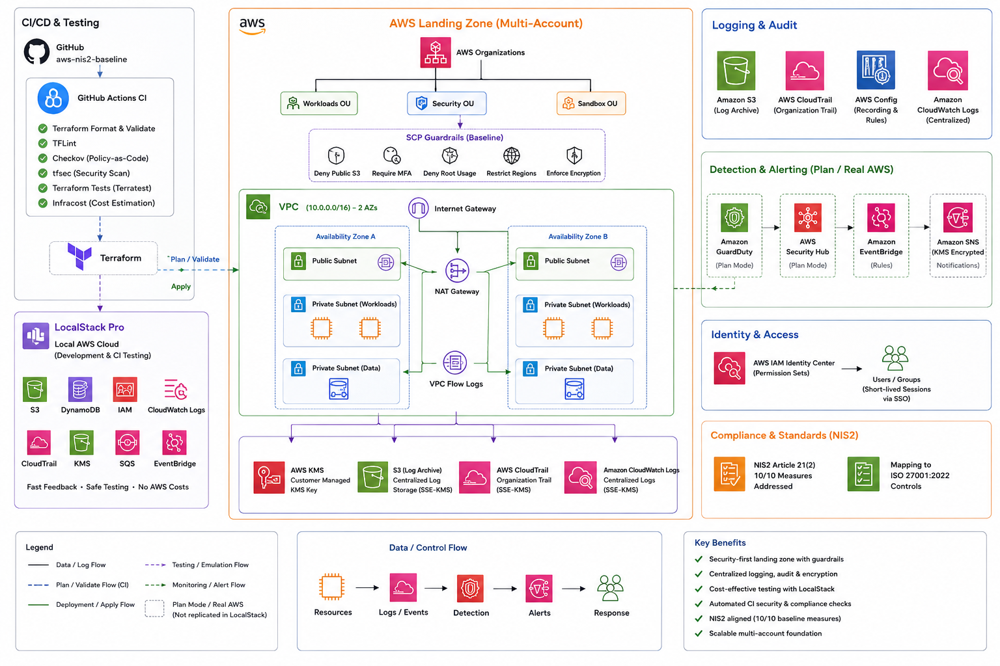

<div align="center">

# AWS NIS2 Security Baseline
---
**A cloud security and GRC project built with Terraform**

<p>
  <a href="https://github.com/olanak/aws-nis2-baseline/actions/workflows/ci.yml">
    
  </a>
  <a href="https://github.com/olanak/aws-nis2-baseline/actions/workflows/docs.yml">
    
  </a>
  
  
  
</p>

</div>

---

## About the Project

This repository is a **personal portfolio project** focused on exploring how cybersecurity requirements from the **EU NIS2 Directive** can be translated into practical cloud infrastructure controls.

The project uses Terraform to build a modular AWS security baseline and maps the implemented controls to **NIS2 Article 21(2)** and relevant **ISO 27001:2022 Annex A** controls.

The main goal was to learn and demonstrate how cloud infrastructure, security engineering, compliance, and Infrastructure as Code can work together in one project.

---

## What I Wanted to Explore

The project was built around a simple question:

**How can regulatory security requirements be represented as actual, testable cloud infrastructure?**

To explore that question, I created reusable Terraform modules for:

- Identity and access management
- Encryption and key management
- Logging and auditing
- Network security
- Threat detection
- Security governance
- Security alerting
- Configuration monitoring
- Backup and data protection

Each module is connected to a specific NIS2 measure and, where applicable, an ISO 27001:2022 control.

---

## NIS2 Article 21(2) Coverage

| Measure | Security Area | Status | Terraform / Documentation |
|:---|:---|:---:|:---|
| (a) | Risk analysis and security policies | ✅ | `aws-config` |
| (b) | Incident handling | ✅ | `cloudtrail`, `vpc`, `guardduty`, `alerting` |
| (c) | Business continuity and backup | ✅ | `s3-baseline` |
| (d) | Supply chain security | ✅ | `docs/supply-chain.md` |
| (e) | Acquisition, development and vulnerability handling | ✅ | `security-hub` |
| (f) | Effectiveness assessment | ✅ | `cloudtrail`, `aws-config` |
| (g) | Basic cyber hygiene | ✅ | `guardduty`, `security-hub` |
| (h) | Cryptography and encryption | ✅ | `kms`, `s3-baseline` |
| (i) | Access control and asset management | ✅ | `organizations`, `scp`, `identity-center` |
| (j) | Multi-factor authentication | ✅ | `identity-center` |

**10 of 10 NIS2 Article 21(2) measures are addressed** within the scope of this project implementation.

---
## Architecture

<div align="center">

**AWS Security Baseline**



</div>

---
The architecture is organized into four main areas:

### Foundation
KMS and the secure S3 baseline provide encryption and protected log storage.

### Logging and monitoring
CloudTrail, AWS Config and VPC Flow Logs provide visibility and audit information.

### Identity and governance
AWS Organizations, SCPs and IAM Identity Center provide account-level guardrails and access controls.

### Detection and alerting
GuardDuty and Security Hub provide security findings, while EventBridge and SNS provide a centralized notification path.

---
## Terraform Modules
<div align="center">

| Module | Purpose | Mode | NIS2 | ISO 27001:2022 |
|---|---|---|---|---|
| **kms** | Customer-managed key, rotation and alias | apply | (h) | A.8.24 |
| **s3-baseline** | Secure bucket with SSE-KMS, TLS-only access and versioning | apply | (c)(h) | A.8.13, A.8.24 |
| **cloudtrail** | Multi-region audit trail with validation and encryption | apply | (b)(f) | A.8.15, A.8.34 |
| **aws-config** | Configuration recorder and NIS2-aligned rules | apply | (a)(f) | A.8.9 |
| **vpc** | Two-AZ network with public/private subnets and flow logs | apply | (b) | A.8.16, A.8.22 |
| **organizations** | AWS Organization and organizational units | apply | (i) | A.5.15 |
| **scp** | Governance policies for root access, regions and logging | apply | (i) | A.5.15, A.8.22 |
| **identity-center** | SSO permission sets, groups and assignments | plan¹ | (i)(j) | A.5.15, A.8.5 |
| **guardduty** | Threat detection and S3 malware protection features | plan² | (b)(g) | A.8.16, A.5.7 |
| **security-hub** | Security Hub with AWS FSBP and GuardDuty integration | plan² | (e)(g) | A.8.8, A.5.36 |
| **alerting** | KMS-encrypted SNS and EventBridge security alerts | apply | (b) | A.5.24–A.5.26 |
</div>

---

### LocalStack limitations
Some AWS services are not fully represented by LocalStack, so the project separates apply-mode and plan-mode validation.

* **¹ IAM Identity Center:** LocalStack can emulate parts of SSO creation but does not provide the complete provisioning-status behavior expected by the Terraform provider.
* **² GuardDuty and Security Hub:** These services are not implemented by LocalStack.

These limitations are documented in the project's learning log and ADRs rather than being hidden.
---
## Repository Structure

```
aws-nis2-baseline/
│
├── modules/
│   ├── kms/
│   ├── s3-baseline/
│   ├── cloudtrail/
│   ├── aws-config/
│   ├── vpc/
│   ├── organizations/
│   ├── scp/
│   ├── identity-center/
│   ├── guardduty/
│   ├── security-hub/
│   └── alerting/
│
├── environments/
│   ├── _composition/
│   ├── dev/
│   └── prod/
│
├── tests/
├── docs/
├── .github/workflows/
├── Makefile
└── docker-compose.yml
```

The `dev` and `prod` environments use the same shared module composition. This keeps the infrastructure definition in one place while allowing the provider configuration to differ between LocalStack and AWS.

---
## Testing
Testing is an important part of the project. The repository uses:
* `terraform test`
* Terraform validation
* `terraform fmt`
* `tflint`
* `tfsec`
* Checkov
* Infracost
* `terraform-docs`
* LocalStack-based integration testing

Each module includes tests for expected security defaults and important configuration behavior. Where LocalStack cannot provide full service behavior, the project uses plan-based validation and documents the limitation.

---
## CI and Automation
GitHub Actions is used to automate the development workflow. The CI pipeline checks formatting, validates Terraform configuration, runs security scanners, generates documentation and executes the Terraform test suite.

The purpose of the pipeline is not simply to make the checks pass. It is also to make security decisions visible and repeatable. Scanner findings can be classified as:
* Fixed
* Deferred
* Accepted
* Suppressed with reason

This provides a small example of how technical security work can connect with GRC practices.
---

## Development Approach
This project was developed as a hands-on learning exercise around:
**Cloud Security → Infrastructure as Code → Compliance Mapping → Security Testing**

A few principles guided the implementation:

<div align="center">
| Principle | Approach |
|---|---|
| **Reusable Terraform** | Security controls are separated into focused modules |
| **Security by default** | Encryption, logging and restrictive policies are built into the baseline |
| **Compliance mapping** | Terraform resources are linked to NIS2 and ISO 27001 controls |
| **Testable infrastructure** | Security assumptions are checked through Terraform tests |
| **Transparent limitations** | Emulator limitations are documented instead of hidden |
| **Automation** | CI runs validation, security checks and tests |

</div>
---
## Quick Start
### Requirements
* Terraform >= 1.9
* Docker
* LocalStack Pro
* A LocalStack authentication token

### Start LocalStack
```bash
make up
```

### Deploy the development environment
```bash
cd environments/dev
terraform init
terraform apply -auto-approve
```

### Run tests
```bash
cd ../..
make test
```
---
## Documentation
<div align="center">
| Document | Description |
|---|---|
| `architecture.md` | Architecture, composition and data flows |
| `nis2-control-mapping.md` | Resource to NIS2 measure and audit evidence mapping |
| `iso27001-crosswalk.md` | NIS2 Article 21 to ISO 27001:2022 Annex A mapping |
| `supply-chain.md` | Supply-chain security considerations |
| `learning-log.md` | Engineering decisions and lessons learned |
</div>

---

## Project Status
**Complete implementation**

The current version contains 11 Terraform modules, covers 10 NIS2 Article 21(2) measures, includes automated testing and CI checks, and documents the architectural and compliance decisions made during development.
---
<br>
<div align="center">
  <strong>Author</strong><br>
  Olana Kenea<br>

</div>

