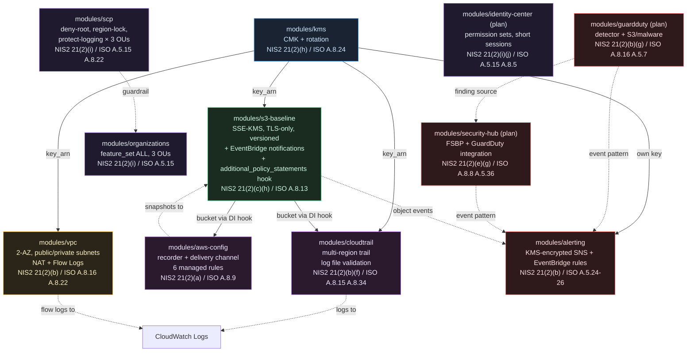
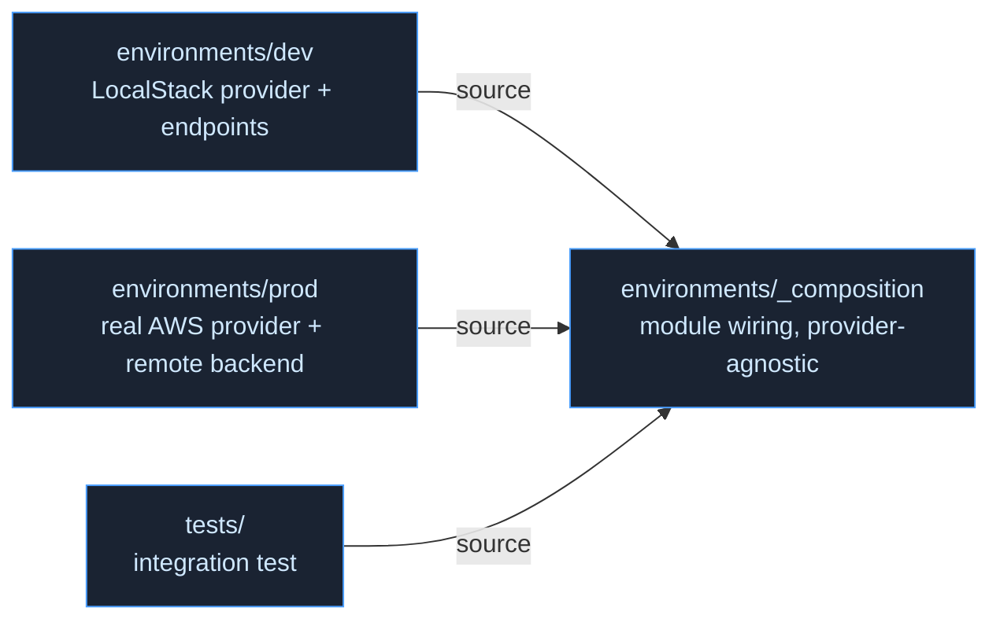

# Architecture — aws-nis2-baseline

A NIS2-aligned AWS landing zone built as composable Terraform modules. This document is the top-to-bottom architectural reference; the raw diagram sources live in [`docs/diagrams/architecture.md`](diagrams/architecture.md).

## Layers

The landing zone is built in four layers, each adding NIS2 Article 21(2) coverage:

1. **Foundation** — `kms`, `s3-baseline`. The cryptographic root and the secure log sink.
2. **Logging & audit** — `cloudtrail`, `aws-config`, `vpc`. What happened, what changed, what flowed.
3. **Identity & governance** — `organizations`, `scp`, `identity-center`. Who is allowed to do what, and the guardrails that hold even against an admin.
4. **Detection & alerting** — `guardduty`, `security-hub`, `alerting`. Active threat detection, compliance scoring, and one notification channel.

## Module composition (end of Week 4)

> **Mode note:** `identity-center`, `guardduty`, and `security-hub` are **plan-mode** — correct Terraform that LocalStack cannot fully apply (provisioning-status 501 for SSO; total non-coverage for GuardDuty and Security Hub). They are validated via `terraform validate` + plan-mode tests and proven on real AWS in the Week 6 validation run. See ADR-021 and ADR-022. All other modules are apply-mode and compose in the integration test.

## Environment structure

The module wiring lives once in `environments/_composition` (provider-agnostic). `dev` and `prod` are thin wrappers that differ only in provider configuration, so the two environments cannot drift — the "identical infrastructure on LocalStack and real AWS" guarantee is structural, not maintained by hand. The integration test under `tests/` is a third, independent consumer of the same composition.

## Data flows

- **KMS is the cryptographic root.** Its CMK encrypts S3 objects, CloudTrail logs, the CloudTrail CloudWatch Log Group, and the VPC flow-log group. The alerting module uses its own dedicated key, whose key policy carries an explicit EventBridge grant.
- **The S3 baseline bucket is the shared log sink.** CloudTrail and AWS Config both deliver to it. Their delivery permissions are injected via the `additional_policy_statements` dependency-injection hook — the bucket module's baseline guarantees (TLS-only, SSE-KMS-required) are preserved while callers add what they need.
- **CloudWatch Logs is the real-time stream.** CloudTrail and VPC Flow Logs both publish there.
- **Governance wraps the account.** Organizations and SCPs apply account-wide guardrails, including `protect-logging`, which denies disabling CloudTrail or AWS Config.
- **Detection fans into one channel.** GuardDuty and Security Hub findings, plus S3 object events, flow through EventBridge rules — matched on event *pattern*, not producer ARN — into a single KMS-encrypted SNS topic. Matching on pattern keeps the alerting module decoupled from the (plan-mode) detection sources.

## NIS2 Article 21(2) coverage (end of Week 4)

| Measure | Covered by |
|---|---|
| (a) Risk analysis & security policies | AWS Config managed rules |
| (b) Incident handling | CloudTrail, VPC Flow Logs, GuardDuty, Alerting |
| (c) Business continuity & backup | S3 versioning |
| (e) Acquisition, development, vuln handling | Security Hub (FSBP) |
| (f) Effectiveness assessment | CloudTrail log file validation, AWS Config |
| (g) Basic cyber hygiene | GuardDuty, Security Hub |
| (h) Cryptography & encryption | KMS, SSE-KMS throughout |
| (i) Access control | Organizations, SCPs, Identity Center |
| (j) Multi-factor authentication | Identity Center (short SSO sessions) |

**9 of 10 measures.** The remaining measure — **(d) supply chain security** — is addressed as a documentation/architecture artifact (provider and module pinning, dependency provenance, SBOM posture) in [`docs/supply-chain.md`](supply-chain.md), bringing coverage to 10 of 10.

## See also

- [`docs/nis2-control-mapping.md`](nis2-control-mapping.md) — resource-by-resource NIS2 mapping
- [`docs/iso27001-crosswalk.md`](iso27001-crosswalk.md) — NIS2 → ISO 27001:2022 Annex A crosswalk
- [`docs/supply-chain.md`](supply-chain.md) — supply-chain security posture, measure (d)
- [`docs/diagrams/architecture.md`](diagrams/architecture.md) — raw diagram sources
