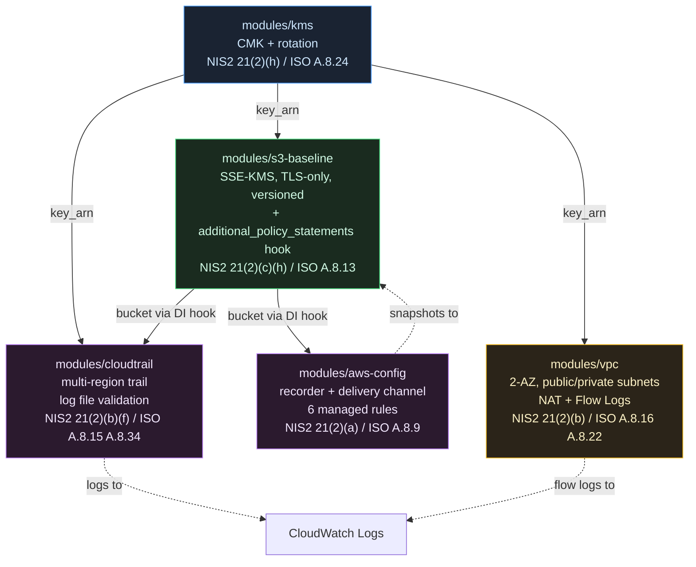

# Architecture — aws-nis2-baseline

## Module composition (end of Week 2)

## Data flows

- **KMS is the crypto root.** Its CMK encrypts S3 objects, CloudTrail logs, the CloudTrail CloudWatch Log Group, and the VPC flow-log group.
- **The S3 baseline bucket is the shared log sink.** CloudTrail and AWS Config both deliver to it. Their delivery permissions are injected via the `additional_policy_statements` dependency-injection hook — the bucket module's baseline guarantees (TLS-only, SSE-KMS) are preserved while callers add what they need.
- **CloudWatch Logs is the real-time stream.** CloudTrail and VPC Flow Logs both publish there, setting up the Week 4 detection layer (EventBridge → SNS).
- **AWS Config continuously evaluates** the deployed resources against 6 NIS2-aligned managed rules.

## NIS2 Article 21 coverage (end of Week 2)

| Measure | Covered by |
|---|---|
| (a) Risk analysis policies | AWS Config rules |
| (b) Incident handling | CloudTrail, VPC Flow Logs |
| (c) Business continuity | S3 versioning |
| (f) Effectiveness assessment | CloudTrail log file validation |
| (h) Cryptography | KMS, SSE-KMS everywhere |
| (i) Access control | IAM service roles (least-privilege) |

Coming in Week 3 (Identity) and Week 4 (Detection): (d) supply chain, (e) secure acquisition, (g) hygiene, (j) MFA.