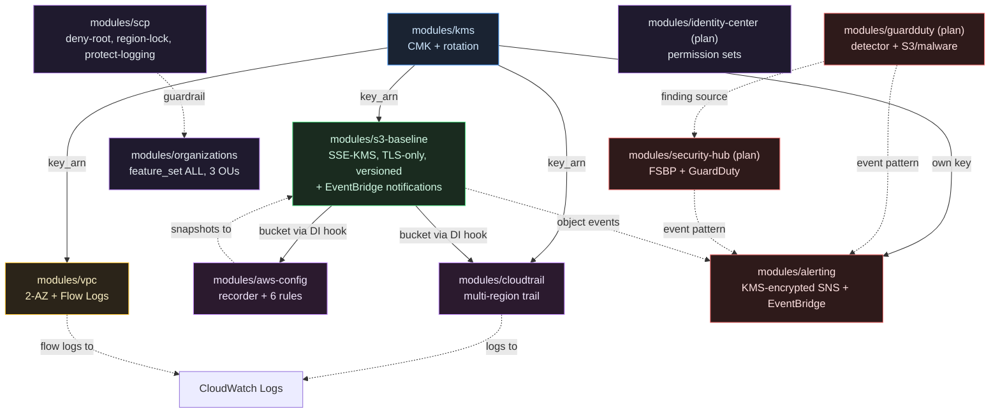
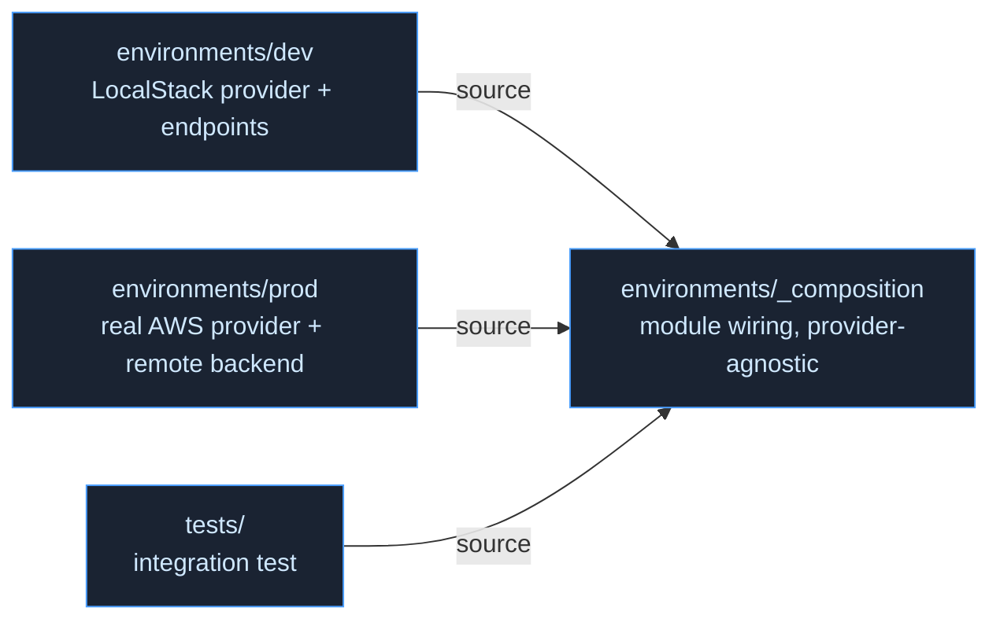

# Architecture diagrams — aws-nis2-baseline

## Module composition (end of Week 4)

```mermaid
graph TD
    KMS["modules/kms<br/>CMK + rotation"]
    S3["modules/s3-baseline<br/>SSE-KMS, TLS-only, versioned<br/>+ EventBridge notifications"]
    CT["modules/cloudtrail<br/>multi-region trail"]
    CFG["modules/aws-config<br/>recorder + 6 rules"]
    VPC["modules/vpc<br/>2-AZ + Flow Logs"]
    ORG["modules/organizations<br/>feature_set ALL, 3 OUs"]
    SCP["modules/scp<br/>deny-root, region-lock, protect-logging"]
    IDC["modules/identity-center (plan)<br/>permission sets"]
    GD["modules/guardduty (plan)<br/>detector + S3/malware"]
    SH["modules/security-hub (plan)<br/>FSBP + GuardDuty"]
    ALERT["modules/alerting<br/>KMS-encrypted SNS + EventBridge"]

    KMS -->|key_arn| S3
    KMS -->|key_arn| CT
    KMS -->|key_arn| VPC
    KMS -->|own key| ALERT
    S3 -->|bucket via DI hook| CT
    S3 -->|bucket via DI hook| CFG
    CT -.->|logs to| CWL["CloudWatch Logs"]
    VPC -.->|flow logs to| CWL
    CFG -.->|snapshots to| S3
    SCP -.guardrail.-> ORG
    GD -.finding source.-> SH
    GD -.event pattern.-> ALERT
    SH -.event pattern.-> ALERT
    S3 -.object events.-> ALERT

    classDef crypto fill:#1a2332,stroke:#4a9eff,color:#cfe8ff
    classDef storage fill:#1a2b1f,stroke:#4ade80,color:#d1fae5
    classDef logging fill:#2b1a2e,stroke:#c084fc,color:#f3e8ff
    classDef network fill:#2b2419,stroke:#fbbf24,color:#fef3c7
    classDef identity fill:#1f1a2e,stroke:#9F6BD8,color:#e6edf3
    classDef detection fill:#2e1a1a,stroke:#f87171,color:#fee2e2

    class KMS crypto
    class S3 storage
    class CT,CFG logging
    class VPC network
    class ORG,SCP,IDC identity
    class GD,SH,ALERT detection
```

## Environment structure

```mermaid
graph LR
    COMP["environments/_composition<br/>module wiring, provider-agnostic"]
    DEV["environments/dev<br/>LocalStack provider + endpoints"]
    PROD["environments/prod<br/>real AWS provider + remote backend"]
    TEST["tests/<br/>integration test"]

    DEV -->|source| COMP
    PROD -->|source| COMP
    TEST -->|source| COMP

    classDef base fill:#1a2332,stroke:#4a9eff,color:#cfe8ff
    class COMP,DEV,PROD,TEST base
```
